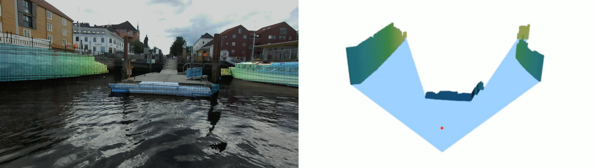

# Free-space estimation


*Docking scenario. Left: stixels colored by distance. Right: the free space (blue) and obstacles, seen from above, with the camera center in red.*

Estimates the free space (navigable water) around an autonomous ferry from a
stereo camera and a lidar. The result is a *stixel world*: the image is split
into 192 vertical columns, and for each one the method finds where the water
ends, how tall the obstacle is, and how far away it is. Seen from above, the
stixel footprints outline the free space around the vessel.

The code was developed for the milliAmpere 2 (MA2) autonomous ferry in
Trondheim and runs on data recorded on 2023-07-11.

## How it works

For each camera frame, `FreeSpacePipeline` in `free_space/pipeline.py` runs:

1. **Water plane (RWPS)** (`rwps.py`): fits a plane to the lower half of the
   ZED stereo point cloud with RANSAC. Pixels close to the plane give a rough
   water mask.
2. **Water segmentation (FastSAM)** (`fastsam.py`): segments the whole image
   and keeps the segments that overlap the rough mask. If the plane fit
   fails, everything below the lowest segment edge is used instead.
3. **Boat detection (YOLO)** (`yolo.py`): finds boats. They are cut out of
   the water mask, and stixels on boats are marked as dynamic.
4. **Temporal filtering** (`temporal_filtering.py`): smooths the water mask
   over the last 3 frames and rejects frames where the segmentation looks
   wrong. A rejected frame leaves the stixels unchanged.
5. **Stixels** (`stixels.py`): places one stixel per column at the water
   edge, sizes its height using disparity edges and segment contours, and
   fuses lidar, stereo and previous-frame depth with a recursive filter. The
   previous frame's stixels are moved into the current frame using the GNSS
   pose.

## Requirements

- Linux with an NVIDIA GPU. Tested on Ubuntu 20.04 (including WSL2) with an
  8 GB RTX 4070 laptop GPU. See [Runtime](#runtime) for speed.
- CUDA 12.
- [ZED SDK 4.2](https://www.stereolabs.com/developers/release) and its Python
  API (`pyzed`), needed to read the `.svo` recordings. You do not need a ZED
  camera.
- Python 3.8. Newer versions may work but have not been tested with these
  pinned dependencies.

## Installation

```bash
git clone https://github.com/johannesskaro/free-space-estimation.git
cd free-space-estimation

python3.8 -m venv venv
source venv/bin/activate
pip install --upgrade pip
pip install -r requirements.txt

# ZED Python API (installs pyzed into the active environment)
python /usr/local/zed/get_python_api.py
```

The model weights (`FastSAM-x.pt` and `yolo11n-seg.pt`) are downloaded
automatically into `weights/` on the first run. To download them by hand, get
them from the
[Ultralytics v8.3.0 release](https://github.com/ultralytics/assets/releases/tag/v8.3.0).

## Data

The dataset is not public. Ask the repository owner for a copy of
`2023-07-11_Multi_ZED_Summer`. The code needs these two folders from it:

```
2023-07-11_Multi_ZED_Summer/
├── ZED camera svo files/   # stereo recordings (.svo), one per camera per sequence
└── bags/                   # ROS 2 bags with lidar and GNSS, one folder per scenario
    ├── scen1/
    ├── scen4_2/
    └── ...
```

Tell the code where the dataset is, either with `--data-root` or once with an
environment variable:

```bash
export MA2_DATA_ROOT=/path/to/2023-07-11_Multi_ZED_Summer
```

## Running

```bash
python run_ma2.py --scenario scen6
```

This opens a window showing the stixels, colored by depth, and the lidar
points that support them. By default it processes 200 frames from the
scenario's start time. The first frame is slow because the ZED SDK and numba
compile on first use.

| Option | Description |
|---|---|
| `--scenario NAME` | Scenario from `configs/scenarios/` (default `scen6`), or a path to a `.yaml` file |
| `--data-root PATH` | Dataset folder (default: `$MA2_DATA_ROOT`) |
| `--num-frames N` | Number of frames to process (default 200) |
| `--no-display` | Don't open a window, e.g. on a server |
| `--save-video out.mp4` | Save the stixel view as a video |
| `--save-bev out.mp4` | Save a bird's-eye view of the free space as a video |
| `--save-jsonl out.jsonl` | Append each frame's stixel footprints, validity, dynamic flags, depth variance and pose to a JSON Lines file |
| `--no-retina-masks` | Compute FastSAM masks at model resolution (576×1024) instead of full resolution. About 3× faster, with coarser water edges. Results differ from the thesis. See [Runtime](#runtime) |

### Runtime

**If you need anything close to real time, use `--no-retina-masks`.** By
default FastSAM computes every mask at full image resolution (1080×1920), and
processing roughly 100 full-resolution masks per frame is slow.

Measured on the RTX 4070 laptop GPU on `scen6` (whole pipeline, after warm-up):

| Setting | Time per frame |
|---|---|
| Default (retina masks) | 0.6–0.95 s |
| `--no-retina-masks` | ~0.3 s |

### Scenarios

| Name | Description |
|---|---|
| `scen1` | Into tunnel |
| `scen2_2` | Crossing |
| `scen4_2` | Docking with boats (kayak and moored boats) |
| `scen5` | Docking with inflatable tube |
| `scen6` | Docking with inflatable tube, further away |

Each scenario file sets the `.svo` file, the bag folder and the start time,
and lists hand-clap timestamps that sync the ZED clock to the GNSS clock.
Other interesting start times are listed as comments in each file. To add a
scenario, copy one of the files and change the values.

The lidar-to-camera calibration only exists for ZED serial **28170706**, so
scenarios must use `.svo` files with that serial in the name.

### Using the pipeline from your own code

```python
from free_space.pipeline import FreeSpacePipeline

pipeline = FreeSpacePipeline(K, baseline, image_size=(1080, 1920),
                             t_body_to_cam=..., R_body_to_cam=...)
result = pipeline.process(timestamp, left_img, disparity_img, depth_img,
                          lidar_uv, lidar_xyz, pose)
result.stixel_footprints          # (192, 2): forward, right [m] in the camera frame
pipeline.stixels.stixel_validity  # which stixels have a valid depth
```

`run_ma2.py` is a complete example. To use another vessel or dataset, write
a loader like `free_space/ma2/dataset.py` and provide your own calibration.

## Repository layout

```
run_ma2.py                  entry point
configs/
  rwps.json                 RANSAC and plane-validation parameters
  scenarios/*.yaml          one file per MA2 scenario
free_space/
  pipeline.py               ties all the steps together
  rwps.py                   water plane fit
  fastsam.py                FastSAM water segmentation and contours
  yolo.py                   boat detection
  temporal_filtering.py     mask smoothing and failure detection
  stixels.py                stixel estimation and depth fusion
  viz.py                    drawing and bird's-eye view (does not affect results)
  zed.py                    ZED .svo reader
  utils.py
  ma2/
    calibration.py          MA2 sensor extrinsics
    dataset.py              scenario configs and synchronized data loading
tools/
  view_lidar.py             play back a scenario's lidar point clouds
  capture_reference.py      record per-frame outputs for regression checks
  compare_reference.py      compare two recordings
```

## Things to know before changing the code

- **MA2-specific assumptions.** Several details only hold for this ferry and
  dataset:
  - A heading offset of π, because MA2 drives backwards relative to its
    heading in this dataset (`stixels.py`, `utils.get_delta_heading`).
  - An expected water-plane height of −1.6 m below the camera
    (`TemporalFiltering(camera_height=...)`).
  - The extrinsics in `ma2/calibration.py`.

  Check all three before using another vessel.
- **Tuning.** Most parameters are keyword arguments with defaults:
  - `Stixels(...)`: number of stixels, min height, max range.
  - The weights in `create_SSM_numba` (`stixels.py`).
  - The IoU threshold in `FastSAMSeg.get_contours_and_water_mask`.
  - The RANSAC settings in `configs/rwps.json`.
- **Results are not always bit-for-bit repeatable.** The ZED SDK's neural
  depth can differ slightly between runs on some sequences (scen4_2, for
  example). Everything after it is deterministic.
- **The `cupy` import in `zed.py` is intentional.** CuPy is not used, but
  importing it changes which CUDA libraries are loaded, which slightly changes
  the ZED depth. It is kept so the code reproduces the thesis results exactly.

## Original thesis code

This repository was cleaned up for handover. The code exactly as it was used
in the thesis, including experiments that were removed here (optical-flow
motion detection, motion-compensated filtering, global map plots and the
BlueBoat/microAmpere runner), is on the
[`thesis-snapshot`](../../tree/thesis-snapshot) branch. The cleaned-up code
produces identical results.
